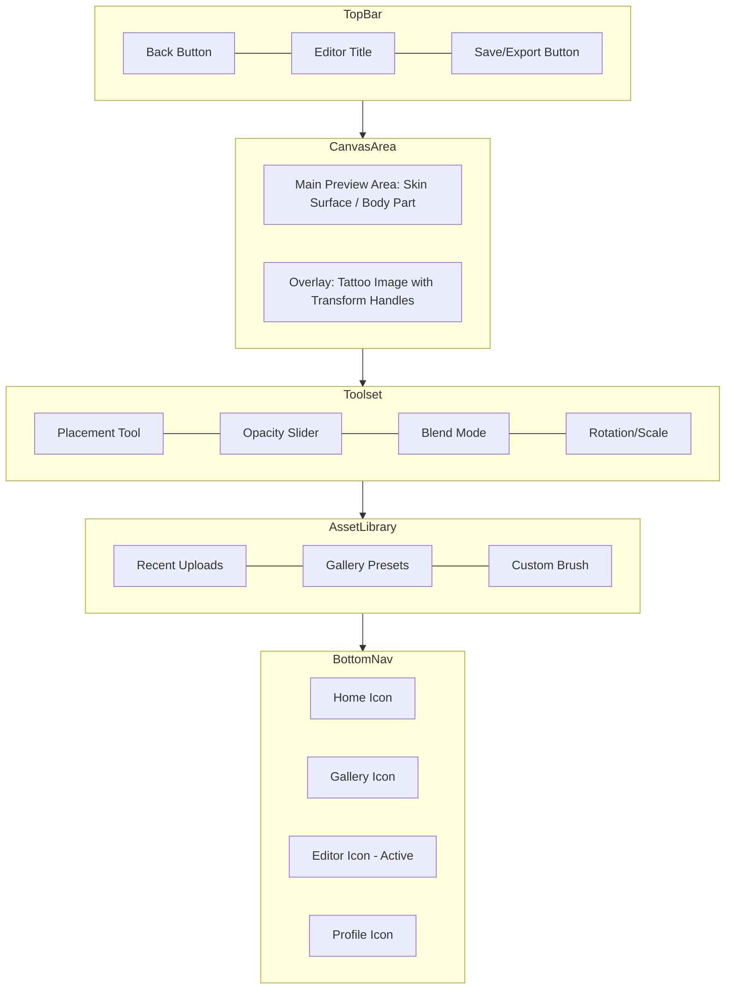

# Editor Screen Mockup

## Wireframe (Mermaid)

## Visual Description
- **Background**: Deep Charcoal (`#0D0D0D`).
- **Canvas Area**: The focal point. A high-resolution photo of a body part (e.g., forearm) with the tattoo image overlaid. The tattoo has transform handles (circles) at the corners, colored with the Electric Purple to Hot Pink gradient.
- **Toolset**: A Glassmorphic panel at the bottom of the canvas.
    - **Sliders**: Custom sliders with a gradient track and a white thumb.
    - **Buttons**: Glassmorphic buttons for blend modes (e.g., Multiply, Overlay).
- **Asset Library**: A slide-up drawer (Glassmorphic) containing a grid of available tattoo designs.
- **Export Button**: A Primary Button (Gradient) in the top right, making it the most prominent action.
