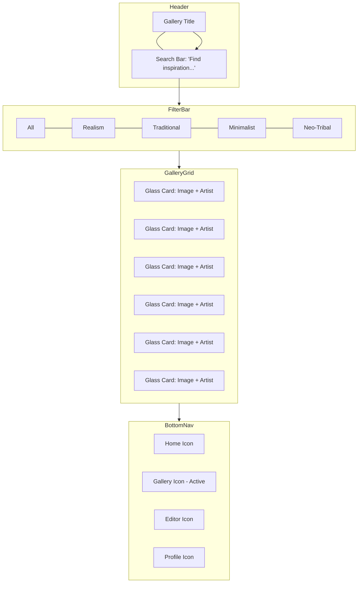

# Gallery Screen Mockup

## Wireframe (Mermaid)

## Visual Description
- **Background**: Deep Charcoal (`#0D0D0D`).
- **Search Bar**: Glassmorphic input field with a Muted Silver (`#B0B0B0`) placeholder and a search icon.
- **Filter Bar**: A horizontal list of capsules. The active filter has a gradient border and Pure White text; inactive filters have a thin grey border and Muted Silver text.
- **Gallery Grid**: A staggered masonry grid of high-fidelity tattoo images. Each image is wrapped in a Glassmorphic card (`20px` radius) that reveals the artist's name and a "Save" heart icon on hover/tap.
- **Visual Effect**: Images have a subtle outer glow to blend the edges with the dark background.
