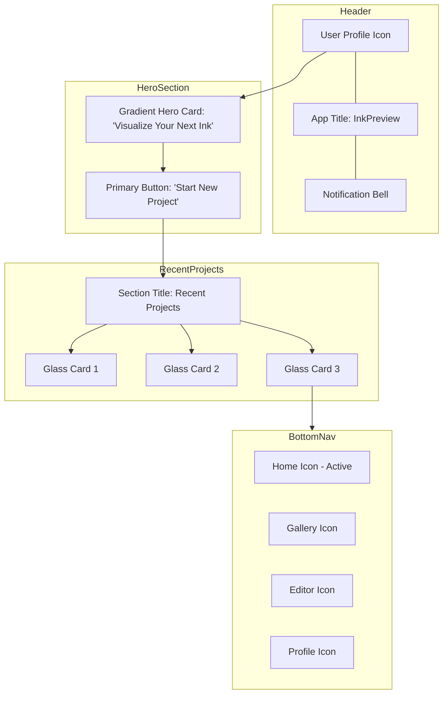

# Home Screen Mockup

## Wireframe (Mermaid)

## Visual Description
- **Background**: Deep Charcoal (`#0D0D0D`) consistent across the screen.
- **Header**: Minimalist. Pure White text for the title, Muted Silver for icons.
- **Hero Card**: A large, rounded rectangle (`20px`) with a vivid Electric Purple to Hot Pink gradient. Text is `Outfit` Bold, Pure White. The "Start New Project" button is a high-contrast white button with a subtle glow.
- **Recent Projects**: A horizontal scrolling list of Glassmorphic cards. Each card has a `rgba(26, 26, 26, 0.4)` fill, `15px` blur, and a thin `rgba(255, 255, 255, 0.12)` border.
- **Navigation**: A fixed bottom bar with a Glassmorphic background. Active icon is highlighted with the brand gradient.
